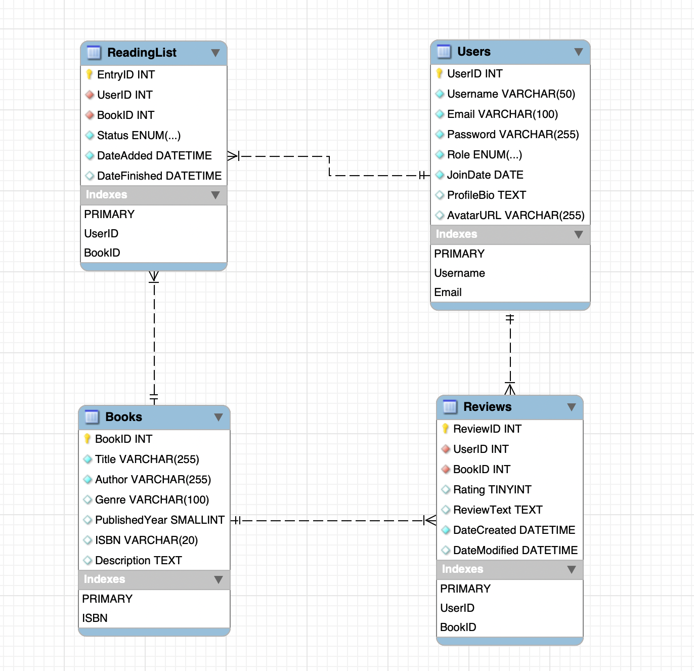

# Ready 2 Read — Book Review & Reading Tracker

A Goodreads-inspired web application built with Java Servlets, JSP, and MySQL.

## Team
- Katia Yarkov (018141825)
- Geeta Renavikar (017035109)

## Tech Stack
- Java 17
- Jakarta Servlet API 6.0 + JSP/JSTL
- JDBC + MySQL
- Maven (WAR packaging)
- Apache Tomcat (runtime)

## Features
- User registration and login with session-based auth
- Book catalog with genre filtering and pagination
- Reading list management (add, update status, remove)
- Book reviews (add, edit, delete) with average ratings
- User profile page
- Admin panel for book management (add, edit, delete)

## Running with Docker

### Prerequisites
- Docker Desktop installed and running

```bash
docker compose up --build
```

Docker will build the WAR, start MySQL, run `create_schema.sql` and `initialize_data.sql` automatically, and wait for the database to be healthy before starting the app.

Open `http://localhost:9090` once both containers are up.

```bash
docker compose down      # stop and remove containers
docker compose down -v   # also wipe the database volume (fresh start)
```

---

## Running Manually

### Prerequisites
- Java 17+
- Maven 3.6+
- MySQL installed and running
- Apache Tomcat 10+

### Database

```bash
mysql -u root -p < ready2read/create_schema.sql
mysql -u root -p < ready2read/initialize_data.sql
```

Schema reference: 

### App

1. **Configure your database credentials** — create `ready2read/src/main/resources/db.properties`:
   ```
   db.url=jdbc:mysql://localhost:3306/ready2read
   db.user=your_mysql_username
   db.password=your_mysql_password
   ```
   This file is gitignored and will never be committed.

2. **Build the WAR**
   ```
   cd ready2read
   mvn clean package
   ```

3. **Deploy to Tomcat** — copy `target/ready2read.war` to your Tomcat `webapps/` directory, then:
   ```
   $CATALINA_HOME/bin/startup.sh
   ```

4. Open `http://localhost:8080/ready2read`

## Project Structure

```
ready2read/
├── create_schema.sql            # DDL — creates all tables
├── initialize_data.sql          # Sample data
└── src/main/
    ├── java/com/ready2read/
    │   ├── dao/                 # Data access (BookDAO, ReviewDAO, ReadingListDAO, UserDAO)
    │   ├── db/                  # DBConnection helper
    │   ├── filters/             # AuthFilter (session guard)
    │   ├── models/              # POJOs (Book, Review, ReadingList, User)
    │   └── servlets/
    │       ├── admin/           # AdminCatalogServlet, AdminBookAdd/Edit/DeleteServlet
    │       ├── CatalogServlet
    │       ├── LoginServlet / LogoutServlet / RegisterServlet
    │       ├── MyReviewsServlet
    │       ├── ProfileServlet
    │       ├── ReadingList*Servlet
    │       └── Review*Servlet
    ├── resources/
    │   └── db.properties        # DB credentials (gitignored)
    └── webapp/
        ├── index.jsp
        └── WEB-INF/jsp/
            ├── admin/           # Admin views
            ├── common/          # Shared sidebar fragments
            ├── catalog.jsp
            ├── login.jsp / register.jsp
            ├── myReviews.jsp
            ├── profile.jsp
            └── readingList.jsp
```
