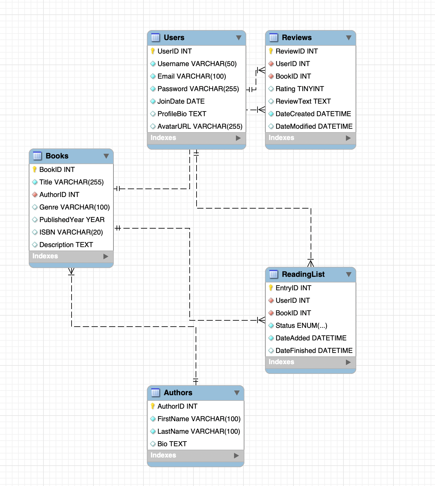

# Ready 2 Read — Book Review & Reading Tracker

A Goodreads-inspired desktop application built with Java, JDBC, and MySQL.

## Team
- Katia Yarkov (018141825)
- Geeta Renavikar (017035109)

## Tech Stack
- Java
- JDBC
- MySQL / MySQL Workbench

## Database Setup

### Schema


### Prerequisites
- MySQL installed and running
- MySQL Workbench (optional but recommended)

### Steps

1. Open MySQL Workbench and connect to your local instance
2. Open a new query tab and run the schema file:
   - Go to **File → Open SQL Script** and select `schema.sql`, or
   - Copy and paste the contents of `schema.sql` into the query tab
3. Hit **Ctrl+Shift+Enter** to run the full script
4. Refresh the Schemas panel to confirm `ready2read` appears
5. Run the seed file the same way using `seed.sql`

### Verify it worked
```sql
USE ready2read;
SHOW TABLES;
```
You should see all 4 tables: Users, Books, Reviews, ReadingList.

## JDBC Setup

### Prerequisites
- Java JDK installed
- MySQL running locally with the `ready2read` database set up (see Database Setup above)

### Steps

1. **Download the MySQL JDBC driver**
   - Go to https://dev.mysql.com/downloads/connector/j/
   - Select **Platform Independent**, download the `.zip`
   - Unzip it and copy `mysql-connector-j-x.x.x.jar` into the `lib/` folder

2. **Configure your database credentials**
   - Copy the example config file:
     ```
     cp db.properties.example db.properties
     ```
   - Open `db.properties` and fill in your MySQL username and password:
     ```
     db.url=jdbc:mysql://localhost:3306/ready2read
     db.user=your_mysql_username
     db.password=your_mysql_password
     ```
   - `db.properties` is gitignored and will never be committed

3. **Compile the project**
   ```
   javac -cp lib/mysql-connector-j-x.x.x.jar src/db/DBConnection.java -d out/
   ```

4. **Test the connection**
   ```
   java -cp out:lib/mysql-connector-j-x.x.x.jar db.DBConnection
   ```
   You should see: `Connected to ready2read database successfully!`

## Project Structure
(to be updated as the project develops)